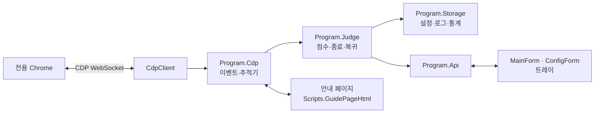

# 기여 안내

TabBouncer에 버그 수정이나 기능을 보태려는 사람을 위한 문서다. 사용법은 [README](README.md)에 있다.

## 준비물

- Windows 11
- [.NET 10 SDK](https://dotnet.microsoft.com/download/dotnet/10.0)
- Google Chrome 136 이상
- 브라우저 스모크 테스트를 돌리려면 Node.js 22 이상
- 데모 페이지를 띄우려면 Python 3 (또는 아무 정적 웹 서버)

## 빌드, 실행, 테스트

```powershell
dotnet build src -c Release
dotnet run --project src -c Release
dotnet run --project src -c Release -- --self-test
node .\tests\browser-smoke.mjs
```

- 빌드 결과는 저장소 루트의 `bin\Release`에 생긴다.
- `--self-test`는 판정 점수 계산을 콘솔에서 검사한다.
- `tests\browser-smoke.mjs`는 headless Chrome과 임시 데이터 폴더로 TabBouncer를 띄워 실제 이벤트 흐름 6가지를 검사한다. 빌드한 뒤에 실행한다.
- 다른 Chromium 계열 브라우저로 스모크 테스트를 돌리려면 `TABBOUNCER_BROWSER`에 실행 파일 경로를 넣는다.

```powershell
$env:TABBOUNCER_BROWSER = "${env:ProgramFiles(x86)}\Microsoft\Edge\Application\msedge.exe"
node .\tests\browser-smoke.mjs
```

단일 실행 파일 배포본은 다음처럼 만든다. 릴리스용 zip은 [릴리스 절차](#릴리스-절차)대로 `build/package.ps1`로 만든다.

```powershell
dotnet publish src -c Release -r win-x64 --self-contained false -o out\fd
dotnet publish src -c Release -r win-x64 --self-contained true -p:PublishSingleFile=true -p:IncludeNativeLibrariesForSelfExtract=true -p:EnableCompressionInSingleFile=true -o out\sc
```

### 데모 페이지로 직접 확인하기

`docs/demo/index.html`은 광고 탭, 버튼 창, 빈 영역 클릭 광고, 폭주, 강제 이동을 재현한다. 광고 탭이 다른 사이트에서 열린 것처럼 보이도록 `127.0.0.1`과 `localhost`를 바꿔 쓰므로 웹 서버로 열어야 한다.

```powershell
python -m http.server 25080 --bind 127.0.0.1 --directory docs/demo
```

TabBouncer의 주소 입력란이나 전용 Chrome 주소창에 `http://127.0.0.1:25080/`을 넣는다.

### 여러 인스턴스를 나눠 띄우기

개발 중에는 평소 쓰는 설정과 섞이지 않게 `--data-dir`을 쓴다. 데이터 폴더마다 독립된 인스턴스가 된다.

```powershell
dotnet run --project src -c Release -- --data-dir="$env:TEMP\tabbouncer-dev" --dry-run
```

## 소스 구조

```text
src/
  Program.cs            진입점, 명령줄 인수, 중복 실행 방지, Chrome 연결 수명 주기
  Program.Chrome.cs     브라우저 실행, 디버깅 포트 탐색(DevToolsActivePort), 안내 페이지
  Program.Cdp.cs        CDP 이벤트 처리, 클릭 추적기 설치(격리 월드), 안내 페이지 명령
  Program.Judge.cs      새 탭 점수(Score), 리다이렉트 점수(ScoreRedirectHijack), 종료·복귀, 도메인 도우미
  Program.Storage.cs    설정 파일 위치·읽기·저장·감시, 로그 회전, 판정 이벤트, 누적 통계, 기록 복원
  Program.Api.cs        GUI가 부르는 기능(등록, 다시 열기, 주소 열기, 진단 정보, 설정 저장)
  Program.SelfTest.cs   --self-test
  CdpClient.cs          CDP WebSocket 클라이언트
  Config.cs             config.json 모델, 내장 광고 목록, 검증
  Models.cs             탭 상태, 클릭 의도, 점수 결과, 최근 항목
  Scripts.cs            클릭 추적 스크립트, 안내 페이지 HTML
  Reasons.cs            판정 사유 코드를 화면 문구로 바꿈
  Localization.cs       languages.json을 읽어 현재 언어 문구를 돌려줌(L.T, L.Format)
  MainForm.cs           메인 창, 트레이, 알림, 단축키
  ConfigForm.cs         설정 창
  ExitDialog.cs         종료 확인 대화상자
  Theme.cs              공용 색과 버튼 모양, 앱 아이콘
  UiState.cs            창 위치·크기 저장
  WindowsIntegration.cs 자동 실행 레지스트리, 바탕화면 바로가기, 탐색기 열기
  config.json           기본 설정 템플릿
  languages.json        화면 문구 표. 한 파일에 언어별(ko, en, …)로 나눠 둠
tests/
  browser-smoke.mjs     실제 Chrome을 구동하는 브라우저 스모크 테스트
docs/
  demo/index.html       수동 확인용 데모 페이지
```



### 처음 읽는 순서

1. `Program.cs`의 `Main`, `RunEngineAsync`, `RunSessionAsync`로 시작과 연결 수명 주기를 본다.
2. `Program.Cdp.cs`의 `OnCdpEvent`, `HandleAttachedTarget`, `InstallIntentTrackerAsync`로 탭 상태와 클릭 추적기 설치를 본다.
3. `Program.Judge.cs`의 `EvaluateAsync` → `AssessIntent` → `Score`를 따라가면 새 탭 판정의 핵심을 이해할 수 있다. 현재 탭 이동은 `EvaluateRedirectHijackAsync`와 `ScoreRedirectHijack`이다.
4. 판정 결과는 `RecordItem`에서 최근 목록, 통계, 안내 페이지, GUI 이벤트로 퍼진다.
5. `MainForm.cs`는 `Program.GetSnapshot`을 0.75초마다 읽어 화면을 갱신하고, 버튼은 `Program.Api.cs`의 메서드를 부른다.

## 작성 규칙

- 사용자에게 보이는 문구는 한국어 평서문("~한다")으로 쓴다. 코드에 문구를 직접 쓰지 않고 `src/languages.json`의 모든 언어 절에 같은 키로 넣은 뒤 `L.T("키")`나 `L.Format("키", 값)`으로 쓴다. 한국어(`ko`)가 기본 언어다.
- 활동 로그 문구도 `languages.json`의 `log.*` 키로 넣는다. 로그는 `Info`, `Success`, `Warning`, `Error`만 쓴다. GUI 프로그램이라 콘솔 출력은 `--self-test`에서만 쓴다.
- `--self-test`는 모든 언어가 기본 언어와 같은 키와 `{0}` 자리표시자를 가졌는지 검사한다.
- 판정 스레드와 GUI 스레드가 설정을 함께 읽는다. 목록을 바꿀 때는 `UpdateConfigFile`로 복사본을 바꿔 한 번에 교체한다.
- 개발 중 포트를 지정해야 하면 TCP 25001~25199 대역을 쓴다(데모 페이지는 25080).
- 빌드는 여러 변경을 모아 필요한 만큼만 돌린다.

## 변경 체크리스트

### 설정 키를 추가할 때

- [ ] `src/Config.cs`에 속성과 기본값을 넣는다. 검사가 필요하면 `Validate`에 추가한다.
- [ ] `src/config.json` 템플릿에 넣는다.
- [ ] 설정 창(`ConfigForm.cs`)에 컨트롤을 넣고, `languages.json`의 모든 언어에 `config.field.<키>`와 `.help` 문구를 넣는다.
- [ ] [docs/config.md](docs/config.md)의 표에 추가한다.
- [ ] [CHANGELOG.md](CHANGELOG.md)에 적는다.

### 판정 사유 코드나 점수를 바꿀 때

- [ ] `Program.Judge.cs`의 `Score` 또는 `ScoreRedirectHijack`을 고친다.
- [ ] `languages.json`의 모든 언어에 `reason.<코드>` 문구를 넣는다.
- [ ] [docs/how-it-works.md](docs/how-it-works.md)의 점수표를 고친다.
- [ ] 필요하면 `Program.SelfTest.cs`의 검사를 맞춘다.

### 화면 언어를 추가할 때

- [ ] `src/languages.json`의 `languages`에 언어 코드(예: `ja`)로 절을 더하고 `name`과 기본 언어의 모든 키를 번역해 넣는다.
- [ ] `dotnet run --project src -- --self-test`로 빠진 키와 자리표시자를 확인한다.
- [ ] [docs/config.md](docs/config.md)의 `language` 설명과 [CHANGELOG.md](CHANGELOG.md)에 적는다.

### 이벤트 흐름을 바꿀 때

- [ ] `tests/browser-smoke.mjs`가 기대하는 계약을 확인한다. `--data-dir`, `--port`, `--auto-start` 인수, `language: "ko"`일 때의 로그 문구 "사용자 클릭 추적을 시작했다"(`log.tracking`), 이벤트 `stage` 값 `user-approved`와 `closed`, 문서 속성 `data-tabbouncer-tracker`다.
- [ ] 이벤트 필드를 바꾸면 [docs/logs.md](docs/logs.md)를 고친다.

## Pull Request 전에

```powershell
dotnet build src -c Release
dotnet run --project src -c Release --no-build -- --self-test
node .\tests\browser-smoke.mjs
```

화면을 바꿨다면 스크린샷을 PR에 붙인다. 문서 이미지(`docs/images`)를 갱신할 때는 100% 배율에서 개인 주소가 없는 예시 사이트로 찍는다.

## 릴리스 절차

1. `src/TabBouncer.csproj`의 `<Version>`을 올린다.
2. [CHANGELOG.md](CHANGELOG.md)에 `## [X.Y.Z] - 날짜` 절을 쓴다.
3. main에 커밋하고 푸시한다.
4. 로컬에서 `build/package.ps1`을 돌린다. `artifacts/`에 두 가지 zip, `SHA256SUMS.txt`, CHANGELOG의 해당 절을 잘라 낸 `release-notes.md`가 생긴다. PowerShell 7이 없으면 `powershell -ExecutionPolicy Bypass -File build\package.ps1`로 돌린다.
5. 코드 서명 환경 변수(`SIGNING_CERTIFICATE_BASE64`, `SIGNING_CERTIFICATE_PASSWORD`)가 있으면 스크립트가 실행 파일에 서명한다.
6. `gh`로 릴리스를 만든다. `vX.Y.Z` 태그는 이 명령이 main의 최신 커밋에 만든다.

   ```powershell
   gh release create vX.Y.Z `
     artifacts/TabBouncer-vX.Y.Z-win-x64.zip `
     artifacts/TabBouncer-vX.Y.Z-win-x64-selfcontained.zip `
     artifacts/SHA256SUMS.txt `
     --title "TabBouncer vX.Y.Z" --notes-file artifacts/release-notes.md
   ```

7. winget·scoop 매니페스트는 [packaging/README.md](packaging/README.md)를 따라 갱신한다.

저장소에는 GitHub Actions 워크플로를 두지 않는다. 빌드·테스트·릴리스는 모두 로컬에서 한다.
