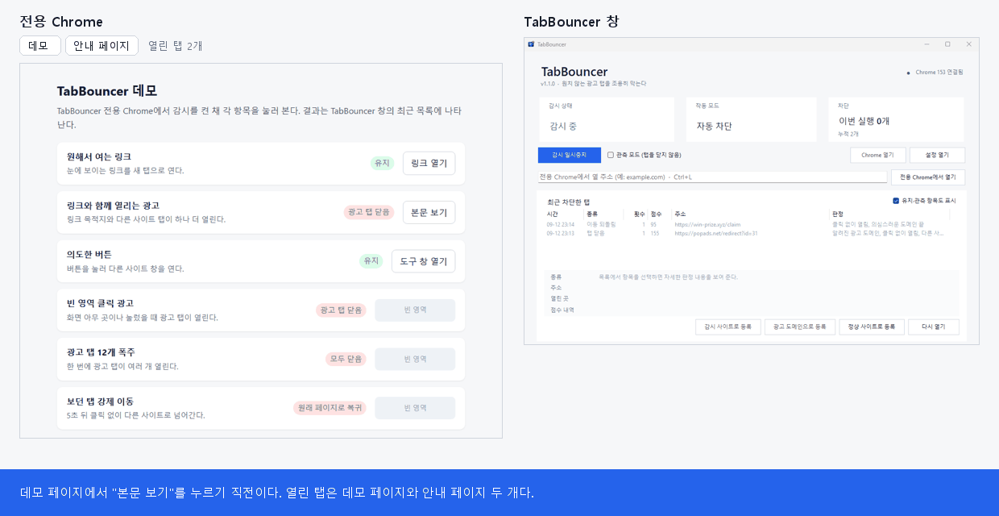
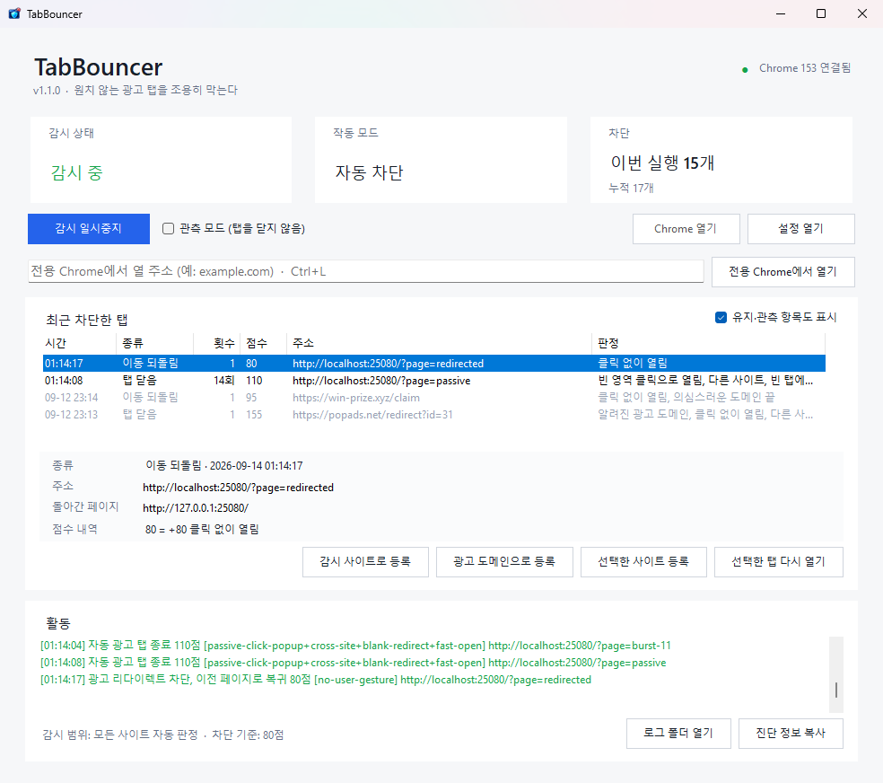
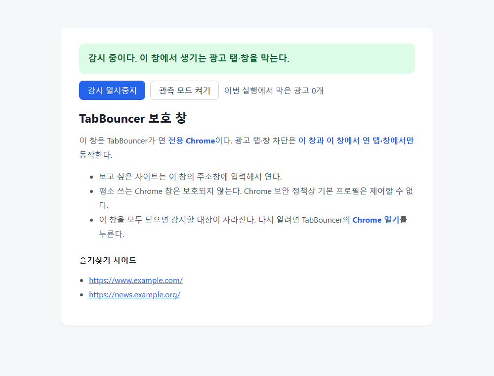
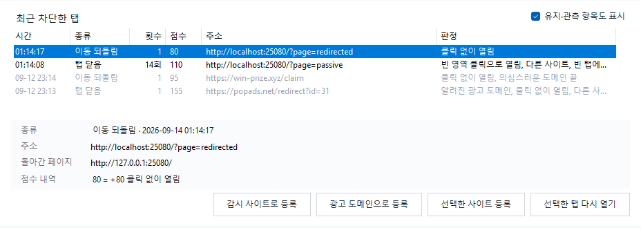
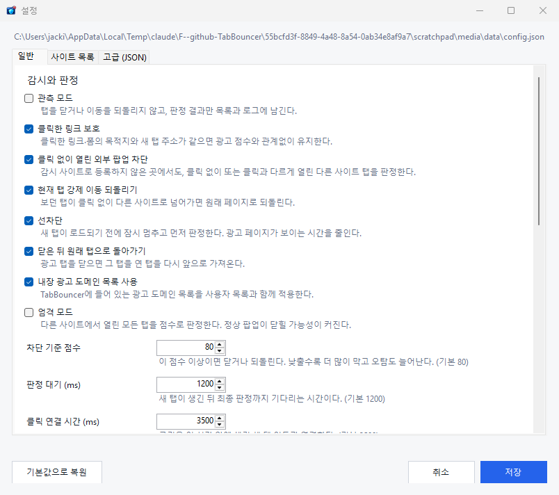

# TabBouncer

[](https://github.com/jacking75/TabBouncer/releases/latest)
[](https://github.com/jacking75/TabBouncer/actions/workflows/ci.yml)
[](LICENSE)

[한국어](README.md) | [English](README.en.md)


TabBouncer detects and closes ad tabs and popup windows that Chrome opens on its own on Windows 11. Tabs you open yourself by choosing a visible link or form are kept, because TabBouncer checks the new tab's address against the link you clicked.

> **TabBouncer only protects the dedicated Chrome window it opens.** It never touches your everyday Chrome windows. Open popup-heavy sites from the dedicated window's address bar or from the address box in the TabBouncer window.



The screenshots show the Korean interface. The interface follows your Windows display language and can be switched to English in Settings.

## What it is

TabBouncer is not a tool that closes every new tab. It keeps what you wanted and filters out the extra ad tabs, popups and forced redirects that web pages open behind your back.

| Feature | Why it helps |
|---|---|
| Compares the clicked link's destination with the new tab's real address | Links you meant to open, and sign-in or payment windows, stay open. |
| Scores external tabs opened without a click and known ad domains | Side-effect ad tabs from a single click are closed automatically. |
| Watches the current tab for automatic cross-site jumps | If the page you are reading turns into an ad site, it goes back. |
| Verdict reasons with score breakdown, observe mode, one-click exceptions | See why something was closed, then fix false positives or missed ads right away. |
| Tray icon, block notifications, start with Windows | Protection runs quietly without a window and only speaks up when it blocks something. |

### Typical uses

- Free download, streaming, webtoon and community sites that open ad tabs after clicks.
- Pages where a link spawns several windows, or where the current tab jumps to another ad site.
- Family members or teammates who suffer from repeated popups but can't use browser developer tools.

## Download and install

### Requirements

- Windows 11, 64-bit
- Google Chrome 136 or later. If Chrome is missing, TabBouncer looks for Microsoft Edge, Brave and Chromium. Edge is covered by the smoke test; Brave and Chromium are experimental.
- [.NET 10 Desktop Runtime](https://dotnet.microsoft.com/download/dotnet/10.0), unless you use the self-contained package

### Get it

Download one of these from [Releases](https://github.com/jacking75/TabBouncer/releases/latest).

| File | Choose it when |
|---|---|
| `TabBouncer-vX.Y.Z-win-x64.zip` | Small download. Use it if the .NET 10 Desktop Runtime is installed or you can install it. |
| `TabBouncer-vX.Y.Z-win-x64-selfcontained.zip` | Includes the runtime, nothing else to install. Larger download. |

Extract it anywhere. `%LOCALAPPDATA%\Programs\TabBouncer` is a good place. If you extract to a folder you cannot write to, such as `C:\Program Files`, settings are saved to `%LOCALAPPDATA%\TabBouncer\config.json` automatically. Packages do not contain `config.json`, so extracting a new version over an old folder keeps your settings.

### First launch

The executable is not code-signed yet, so Windows SmartScreen may show "Windows protected your PC". Check that the file matches `SHA256SUMS.txt` from the release, then choose **More info → Run anyway**.

```powershell
Get-FileHash .\TabBouncer-v1.1.0-win-x64.zip -Algorithm SHA256
```

1. Run `tabbouncer.exe`.
2. Press **Start monitoring**. The dedicated Chrome window opens with it.
3. Type the site you want into the dedicated window's address bar.

For the first few days, turn on **Observe mode**. TabBouncer then records the tabs it would have closed without closing them. Turn it off once the results look right.

## Using TabBouncer

### 1. Start monitoring



For safety, monitoring is off every time the program starts. When the yellow banner is shown, press **Start monitoring**. If the dedicated Chrome is closed, it opens as well. If pressing the button every time is tedious, turn on **Settings → General → Start monitoring on launch**.

If you close every dedicated Chrome window while monitoring, an orange banner and the window title say "Chrome closed". TabBouncer never reopens a Chrome you closed on its own. Press **Open Chrome** to bring it back.

### 2. Browse in the dedicated Chrome window



The dedicated Chrome uses a profile separate from your everyday one. Open sites in whichever way is convenient.

- Type into the dedicated window's address bar.
- Type into the address box of the TabBouncer window and press Enter (Ctrl+L jumps there).
- Click a **Favorite sites** link on the guide page. Manage the list in Settings → Site lists.
- Select a favorite site in Settings and press **Create desktop shortcut**. If TabBouncer is running, the shortcut opens a new tab in its dedicated Chrome. If not, it starts TabBouncer and opens the dedicated Chrome at that address. Monitoring still starts off, so press **Start monitoring** or enable "Start monitoring on launch".

The guide page can also pause monitoring and toggle observe mode.

### 3. Review results and add exceptions



The **Recently blocked** list shows closed tabs, reverted redirects, tabs kept because they scored just below the threshold, and tabs observe mode would have closed. When the same kind of entry repeats for the same site (host), TabBouncer does not add a new row; it increases the number in the **Count** column instead. That row shows the latest time and address, and the detail panel shows how many times it repeated and when it first happened. Select an entry to see the reasons and per-item scores in the detail panel. Entries from previous runs are shown in grey.

| Situation | What to do |
|---|---|
| A legitimate site was closed | Select the entry and press **Reopen selected** and **Allow selected site**. The domain and its subdomains are never closed again. |
| An ad was not closed | Select the "Kept" entry and press **Mark as ad domain**. If that tab is still open it is closed right away. |
| One site keeps spawning ads | Select an entry opened from that site and press **Watch opener site**. Tabs it opens are judged more aggressively. |

Without a selection, **Reopen** and **Allow site** apply to the most recently closed entry.

### 4. Let it run in the tray

Minimizing or pressing the close button (X) hides TabBouncer to the notification area. When it blocks an ad, Windows shows a notification; several blocks within 3 seconds are grouped. The tray menu offers monitoring, observe mode, Open Chrome, Open log folder and Exit. When you really exit, TabBouncer asks whether to close the dedicated Chrome too.

Turn on **Settings → General → Start with Windows** to start minimized in the tray when you sign in.

### Keyboard shortcuts

| Keys | Action |
|---|---|
| Ctrl+M | Start or pause monitoring |
| Ctrl+D | Toggle observe mode |
| Ctrl+O | Open the dedicated Chrome |
| Ctrl+L | Jump to the address box |
| Ctrl+Z | Reopen the selected (or latest) tab |
| Ctrl+, | Open Settings |
| Ctrl+Q | Exit |
| Ctrl+S / Esc | Save / cancel in Settings |

## How it decides

TabBouncer watches new tabs and navigations of the dedicated Chrome through the Chrome DevTools Protocol (CDP). Each page gets a short click-intent script that runs in an isolated world page scripts cannot see.

| Situation | Result |
|---|---|
| You clicked a visible link and the new tab matches its destination | Kept |
| You clicked a link but a separate external tab opened as well | Judged as an ad tab |
| An external tab opened when you clicked a blank area or an invisible link | Judged as an ad tab |
| A normal external window opened from an explicit control such as a button | Treated as your action and kept |
| An external tab opened without any user action | Judged as an ad tab |
| A tab without an opener, such as the address bar or the new tab button | Kept |
| Sign-in, OAuth or payment flows, or allowed sites | Kept |
| A page script moves the current tab to another site without a click | Returned to the previous page |
| You moved the current tab from the address bar, a bookmark or Back | Kept |
| Tabs that were already open before TabBouncer connected | Kept |

Scores, timing and limitations are described in [How it works](docs/how-it-works.md) (Korean).

## Settings

**Settings** edits `config.json` in three tabs: General, Site lists and Advanced (JSON). Saving validates and applies the values immediately. Editing the file by hand also reloads automatically.



The most common keys:

```json
{
  "dryRun": false,
  "allowedSites": ["my-safe-site.example"],
  "watchedSites": ["problem-site.example"],
  "favoriteSites": ["https://problem-site.example/"]
}
```

- `dryRun` is observe mode: record verdicts without closing tabs.
- Domains in `allowedSites`, and their subdomains, are always kept.
- `watchedSites` are sites that often spawn ads; tabs they open are judged more aggressively.
- `favoriteSites` are shortcuts on the guide page.

Every key and default is listed in the [settings reference](docs/config.md), and command-line options in [command-line options](docs/cli.md) (Korean).

## Help

- [Troubleshooting](docs/troubleshooting.md): ads not closed, legitimate tabs closed, Chrome won't connect
- [FAQ](docs/faq.md): why not an extension, why everyday Chrome isn't protected, using it with ad blockers
- [Reading the logs](docs/logs.md): formats of `tabbouncer.log` and `events.jsonl`
- Report bugs, false positives and missed ads in [Issues](https://github.com/jacking75/TabBouncer/issues/new/choose). Paste the output of **Copy diagnostics** from the TabBouncer window.

These documents are written in Korean. Browser translation works well on them.

## Privacy and security

- TabBouncer sends nothing over the network. There are no update checks and no usage statistics.
- The activity log and verdict events stay in `%LOCALAPPDATA%\TabBouncer` on this PC. They contain the addresses you visited, so remove them before sharing. Each log keeps at most two older files after it grows past 5 MB.
- The dedicated Chrome's debugging port listens on `127.0.0.1` only. Other programs running on the same PC can still control the dedicated Chrome through it. On a PC that runs untrusted software, don't sign in to important accounts in the dedicated window.
- The dedicated profile is separate from your everyday Chrome profile and shares no passwords, extensions or bookmarks.

## Uninstall

1. Choose **Exit** from the tray icon menu.
2. If you enabled auto start, turn off **Settings → General → Start with Windows** and save first. If the folder is already gone, delete the `TabBouncer` value under `HKCU\Software\Microsoft\Windows\CurrentVersion\Run`.
3. Delete the program folder.
4. Delete `%LOCALAPPDATA%\TabBouncer`. This removes the dedicated Chrome profile, logs and statistics.
5. Delete any `TabBouncer - site.lnk` shortcuts you created on the desktop.

## For developers

```powershell
dotnet build src -c Release
dotnet run --project src -c Release -- --self-test
node .\tests\browser-smoke.mjs
```

Build output goes to `bin\Release`. Source layout, reading order and contribution rules are in [CONTRIBUTING.md](CONTRIBUTING.md), and the change history is in [CHANGELOG.md](CHANGELOG.md) (both Korean).

## License

[MIT License](LICENSE)
