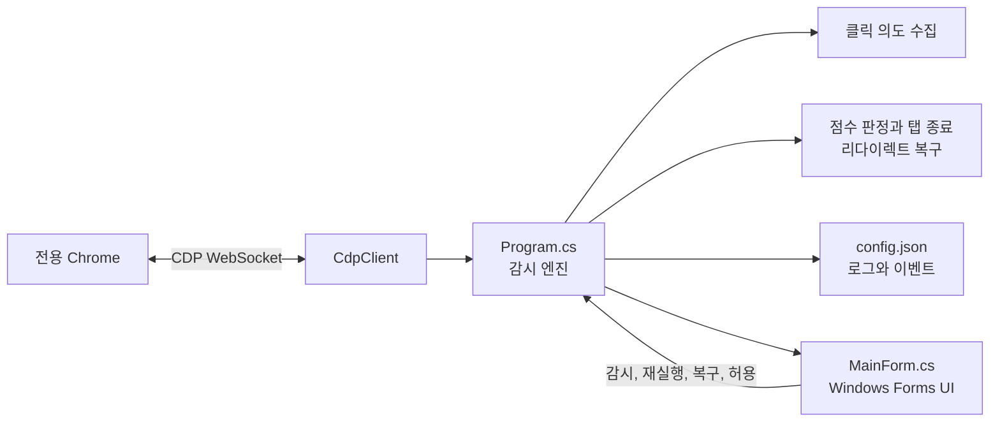

# TabBouncer


TabBouncer는 Windows 11의 Chrome에서 자동으로 생기는 광고 탭과 팝업 창을 감지해 닫는 .NET 10 프로그램이다. 사용자가 눈에 보이는 링크나 폼을 직접 선택해 연 탭은 목적지 URL을 대조해 유지한다.

## 판정 방식

프로그램은 Chrome DevTools Protocol(CDP)로 새 탭을 감시한다. 각 페이지에는 클릭 의도만 수집하는 짧은 스크립트를 CDP로 주입한다.

| 상황 | 처리 |
|---|---|
| 눈에 보이는 링크를 클릭했고 새 탭 URL이 링크 목적지와 일치함 | 유지 |
| 링크를 클릭했지만 별개의 외부 탭이 함께 열림 | 광고 탭으로 판정 |
| 빈 영역이나 투명 링크를 눌렀을 때 외부 탭이 열림 | 광고 탭으로 판정 |
| 버튼 등 명시적인 컨트롤을 눌러 일반 외부 창이 열림 | 사용자 동작으로 가중치를 낮춰 유지 |
| 사용자 동작 없이 외부 탭이 생성됨 | 광고 탭으로 판정 |
| 주소창 입력, 새 탭 버튼 등 opener 없는 일반 탭 | 유지 |
| 로그인, OAuth, 결제 흐름 또는 화이트리스트 도메인 | 유지 |
| 페이지 스크립트가 클릭 없이 현재 탭을 다른 사이트로 이동시킴 | 원래 페이지로 복귀 |
| 주소창 입력, 북마크, 뒤로 가기로 현재 탭을 이동함 | 유지 |
| TabBouncer가 연결되기 전부터 열려 있던 탭 | 유지 |

클릭한 URL이 최초 요청과 일치하면 그 뒤 서버 리다이렉트를 거쳐도 같은 사용자 요청 탭으로 보호한다. 명시적으로 클릭한 링크라면 목적지가 알려진 광고 도메인이어도 닫지 않는다.

새 탭·창뿐 아니라 **이미 보고 있던 탭 자체**가 스크립트에 의해 다른 사이트로 강제 이동되는 경우도 감시한다. 탭이 마지막으로 머문 페이지를 신뢰 기준으로 기록해 두고, 페이지(스크립트·링크·meta refresh)가 시작한 이동이 클릭 없이(또는 화면의 보이지 않는 요소를 클릭한 직후) 다른 사이트로 넘어가면 광고 리다이렉트로 보고 원래 URL로 되돌린다. 주소창 입력·북마크·뒤로 가기처럼 브라우저에서 직접 한 이동, 같은 사이트 안에서의 이동, 버튼을 눌러서 생긴 이동, 로그인·결제 흐름, 화이트리스트·허용 사이트로의 이동은 대상에서 제외한다. 같은 페이지가 30초 안에 계속 다시 리다이렉트하면 두 번 되돌린 뒤에는 이동을 허용해 무한 반복을 막는다. 이 기능은 `blockRedirectHijack`으로 끌 수 있다.

## 요구 환경

- Windows 11
- Google Chrome 136 이상
- .NET 10 Runtime 또는 SDK

Chrome 136 이상에서는 원격 디버깅에 기본 Chrome 프로필을 쓸 수 없다. TabBouncer는 `%LOCALAPPDATA%\TabBouncer\ChromeProfile` 전용 프로필로 Chrome을 실행한다. 그래서 **광고 차단은 TabBouncer가 연 전용 Chrome 창과 그 창에서 연 탭·창에서만 동작하고, 평소 쓰는 Chrome 창은 보호되지 않는다.** 보고 싶은 사이트는 전용 창의 주소창에서 연다.

## 프로젝트 구조

소스 코드와 프로젝트 파일은 `src` 디렉토리에 있다.

```
src/
  Program.cs         # 진입점과 CDP 감시·판정 로직
  MainForm.cs        # Windows GUI
  ConfigForm.cs      # 설정 편집 다이얼로그
  TabBouncer.csproj  # 프로젝트 파일
  config.json        # 기본 설정 템플릿
tests/
  browser-smoke.mjs  # 실제 Chrome을 구동하는 브라우저 스모크 테스트
```

## 빌드와 실행

```powershell
dotnet build src -c Release
dotnet run --project src -c Release
```

단일 실행 파일을 만들려면 다음 명령을 사용한다.

```powershell
dotnet publish src -c Release -r win-x64 --self-contained false
```

생성 파일은 `bin\Release\win-x64\publish\tabbouncer.exe`에 있다. 실행하면 디버깅 포트 9222와 전용 프로필을 사용하는 Chrome을 자동으로 열고, 이 창에서 브라우징해야 차단된다는 안내 페이지를 보여준다(`startUrl`을 지정하면 그 주소를 연다). 이미 전용 Chrome이 떠 있으면 새로 띄우지 않고 그 Chrome에 연결한다.

전용 Chrome 창을 모두 닫으면 TabBouncer는 Chrome을 다시 띄우지 않고 기다린다. 다시 감시하려면 GUI의 **"Chrome 열기"** 버튼을 누른다.

TabBouncer는 Windows GUI 프로그램이다. 실행하면 창은 뜨지만 감시는 꺼진 상태이며, **"감시 시작" 버튼을 눌러야** 광고 탭을 판정하고 닫기 시작한다. 감시가 꺼져 있는 동안에는 프로그램 창 상단에 노란 경고 배너가 뜨고 창 제목이 "TabBouncer - 감시 꺼짐"으로 바뀐다. 전용 Chrome의 안내 페이지도 같은 상태를 실시간으로 보여주며, 꺼져 있으면 탭 제목 앞에 `[감시 꺼짐]`이 붙는다. 실행 창에서 Chrome 연결 상태와 최근 차단 내역을 확인하고 감시 상태를 바꿀 수 있다.

테스트나 별도 인스턴스에서 설정과 프로필 위치를 분리하려면 `--data-dir=C:\원하는\경로`를 지정한다.
Chrome에 추가 실행 인수가 필요하면 생성된 설정의 `chromeArguments` 배열에 넣는다.

## 사용 방법

### 1. TabBouncer를 실행하고 감시를 시작한다

프로그램을 실행하면 감시는 안전을 위해 항상 꺼진 상태로 시작한다. 노란 안내 영역과 **감시 상태: 일시중지**를 확인한 뒤, 왼쪽의 **"감시 시작"** 버튼을 누른다. Chrome이 연결되어 있지 않으면 오른쪽의 **"Chrome 열기"** 버튼으로 전용 Chrome 창을 연다.


감시를 시작하면 상태가 **감시 중**으로 바뀌고, 이후 전용 Chrome에서 새로 생기는 탭과 창을 판정한다. 처음에는 **관측 모드(탭을 닫지 않음)** 를 켜서 어떤 항목이 차단 대상인지 활동 로그로 확인해도 된다.

### 2. 전용 Chrome 창에서 웹을 연다

TabBouncer가 여는 Chrome은 일반 Chrome 프로필과 분리된 전용 창이다. 이 창의 주소창에 방문할 사이트를 입력해 사용한다. 안내 페이지가 보이면 보호 창이 정상적으로 열려 있다는 뜻이다.


이 전용 창에서 사용자 의도로 연 링크와 버튼 동작은 최대한 유지한다. 반면 클릭과 무관하게 열리거나, 클릭한 목적지와 다른 외부 탭으로 함께 열린 광고성 팝업은 닫는다. 현재 보던 탭이 자동으로 외부 사이트로 이동하면 원래 페이지로 되돌린다.

### 3. 차단 결과를 확인하고 예외를 등록한다

TabBouncer 창의 **최근 차단한 탭**에서 주소, 점수, 판정 사유를 확인한다. 정상 사이트가 잘못 닫혔다면 항목을 선택한 뒤 **"다시 열기"**로 복구하거나 **"정상 사이트로 등록"**으로 해당 도메인과 하위 도메인을 허용한다. 설정을 직접 바꾸려면 **"설정 열기"**에서 `config.json`을 저장하면 즉시 다시 읽는다.

## 설정

첫 실행 때 **실행 파일과 같은 폴더**에 `config.json`을 만든다. 실행 중 파일을 저장하면 변경 사항을 자동으로 다시 읽는다. `config.json`의 `enabled` 값과 무관하게, 프로그램을 실행할 때마다 감시는 항상 꺼진 상태로 시작하고 GUI의 "감시 시작" 버튼을 눌러야 켜진다. 실행 중에 설정을 저장해 다시 읽어도 감시 켜짐·꺼짐 상태는 바뀌지 않는다. 자동화된 테스트 등 GUI 조작 없이 바로 감시를 켜야 하면 `--auto-start` 인수를 추가한다.

로그와 Chrome 전용 프로필은 `%LOCALAPPDATA%\TabBouncer`에 저장한다. 프로그램은 콘솔 창이 없으므로 활동 로그는 화면 표시 없이 `tabbouncer.log`(사람이 읽는 로그)와 `events.jsonl`(판정 이벤트, 관측 모드에서 특히 유용)에 텍스트로 남는다.

광고가 자주 생기는 사이트를 `watchedSites`에 추가하면 알려지지 않은 광고망도 더 적극적으로 차단한다.
항상 정상으로 취급할 사이트는 `allowedSites`에 등록한다. 등록한 도메인과 모든 하위 도메인의 탭·새 창은 광고 점수와 관계없이 닫지 않는다.

```json
{
  "dryRun": false,
  "strictMode": false,
  "protectExplicitClicks": true,
  "blockAutomaticCrossSitePopups": true,
  "blockRedirectHijack": true,
  "closeThreshold": 80,
  "allowedSites": [
    "my-safe-site.example"
  ],
  "watchedSites": [
    "problem-site.example"
  ]
}
```

`dryRun`은 탭을 실제로 닫지 않고 판정 결과만 GUI 활동 목록과 `events.jsonl`에 기록하는 관찰 모드다. 처음 관찰만 하려면 GUI에서 관측 모드를 켜거나 `dryRun`을 `true`로 바꾸거나 `--dry-run` 인수를 사용한다. `false`이면 종료 조건을 만족한 탭을 실제로 닫는다. `strictMode`는 정상 팝업 오탐 가능성을 높이므로 기본값을 유지하는 편이 좋다.

## GUI 기능

- Chrome 연결, 감시 상태, 작동 모드, 최근 차단 수 확인
- 감시 시작, 일시중지, 재개
- 감시가 꺼져 있으면 상단 경고 배너와 창 제목으로 표시
- 전용 Chrome이 닫혀 있을 때 "Chrome 열기"로 다시 실행
- 실제 종료와 관측 모드 전환
- 마지막으로 닫은 탭 다시 열기
- 마지막으로 닫은 도메인을 정상 사이트로 등록
- "설정 열기" 버튼으로 프로그램 안에서 `config.json`을 직접 편집하고 저장(저장하면 자동으로 다시 적용)

종료 횟수 제한은 없다. 짧은 시간에 광고 탭이나 창이 10개 이상 생성돼도 광고로 판정되는 항목은 모두 닫는다. 브라우저의 마지막 일반 탭은 닫지 않는다.

## 자체 테스트

```powershell
dotnet run --project src -c Release -- --self-test
```

클릭 URL 일치, 별도 광고 탭, 버튼 팝업, 버튼으로 열린 등록 광고 도메인, 자동 외부 팝업, opener 없는 탭, 로그인 흐름, 등록한 정상 사이트 보호, 현재 탭 리다이렉트 하이재킹 차단(같은 사이트 이동·버튼 이동·로그인 흐름 제외 포함)을 검사한다. 판정 점수 계산을 확인하는 단위 검사이며, 실제 Chrome 이벤트 흐름은 아래 스모크 테스트가 다룬다.

실제 Chrome을 headless 모드로 실행하는 브라우저 스모크 테스트는 빌드 후 다음과 같이 실행한다. Node.js 22 이상이 필요하다.

```powershell
node .\tests\browser-smoke.mjs
```

## 판별 한계

웹페이지의 임의 JavaScript 버튼이 여는 창은 사람이 기대한 결과인지 코드만으로 완벽하게 알 수 없다. TabBouncer는 실제 링크 목적지가 있으면 정확히 대조하고, 일반 버튼은 사용자 의도로 우선 보호한다. 특정 정상 서비스가 잘못 닫히면 GUI의 "정상 사이트로 등록" 버튼을 누르거나 `allowedSites`에 도메인을 추가한다.

현재 탭 리다이렉트 하이재킹 차단도 같은 한계를 가진다. 클릭 없이 다른 사이트로 자동 이동하는 정상 서비스(세션 만료 안내, 자동 로그아웃 이동 등)를 오탐할 수 있으며, 이때도 `allowedSites` 등록이나 `blockRedirectHijack` 끄기로 대응한다.

## 코드를 이해하거나 확장하려면

TabBouncer는 Windows Forms UI 위에 Chrome DevTools Protocol(CDP) 감시 엔진을 둔 단일 실행 파일 구조다. `Program.cs`가 앱의 중심이며, Chrome 연결·CDP 이벤트 처리·사용자 클릭 의도 수집·광고 점수 판정·탭 종료·설정과 로그를 함께 관리한다. UI는 엔진 상태를 표시하고 사용자의 명령을 전달하는 역할에 집중한다.



처음 볼 때는 다음 순서가 가장 빠르다.

1. [Program.cs](src/Program.cs)의 `Main`, `RunEngineAsync`, `RunSessionAsync`로 시작과 Chrome 연결 수명 주기를 본다.
2. 같은 파일의 `CdpClient`와 `OnCdpEvent`에서 CDP 메시지를 요청·수신하고 페이지 이벤트로 분기하는 방식을 확인한다.
3. `HandleIntentBinding`, `AssessIntent`, `EvaluateAsync`, `Score`를 따라가면 클릭 의도와 새 탭 URL을 대조해 점수를 만들고 `Target.closeTarget`으로 종료하는 핵심 흐름을 이해할 수 있다.
4. 현재 탭 강제 이동 기능은 `HandleFrameNavigated`, `EvaluateRedirectHijackAsync`, `ScoreRedirectHijack`에 있다. 새 탭 판정과 별도로 원래 URL로 되돌리는 경로다.
5. [MainForm.cs](src/MainForm.cs)는 상태 카드, 최근 차단 목록, 감시·관측 모드·Chrome 재실행 버튼을 만들고 `Program`의 공개 메서드를 호출한다. [ConfigForm.cs](src/ConfigForm.cs)는 `config.json` 편집과 JSON 검증 UI만 담당한다.
6. 설정 항목을 추가한다면 [config.json](src/config.json)과 `Config`를 먼저 맞추고, 판정에 쓰는 값이면 `Score` 또는 `ScoreRedirectHijack`과 자체 테스트를 함께 수정한다. 실제 Chrome 이벤트 흐름은 [browser-smoke.mjs](tests/browser-smoke.mjs)에서 재현하고 검증한다.
