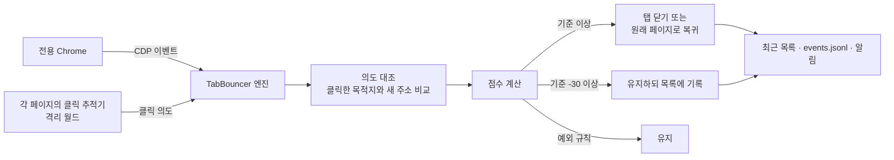

# 판정 방식 상세

TabBouncer가 새 탭을 닫거나, 현재 탭의 이동을 되돌리거나, 그대로 두는 기준을 설명한다. 점수와 시간 값은 `src/Program.Judge.cs`와 `src/Config.cs`의 현재 코드 기준이다.

## 전체 흐름

1. TabBouncer는 전용 Chrome에 CDP로 연결해 새 탭 생성, 페이지 이동, 문서 요청 이벤트를 받는다.
2. 새 탭은 로드 전에 잠시 멈춘다(선차단). 0.15초 기다려 클릭 기록이 먼저 도착하게 한 뒤 첫 판정을 한다.
3. 각 페이지에 클릭 추적 스크립트를 넣는다. 이 스크립트는 사용자의 실제 포인터·클릭·폼 제출만 기록한다.
4. 새 탭 주소가 바뀔 때마다, 그리고 탭이 생긴 뒤 1.2초가 지났을 때 점수를 계산한다.
5. 현재 탭이 페이지 스크립트로 다른 주소로 넘어가면 따로 리다이렉트 점수를 계산한다.

## 클릭 의도

클릭 추적기는 사용자가 누른 요소를 다섯 종류로 나눈다. 스크립트가 만든 가짜 이벤트(`isTrusted`가 false)는 기록하지 않는다.

| 종류 | 조건 | 새 탭 판정에서 |
|---|---|---|
| `link` | 눈에 보이고 글자나 설명이 있는 링크 | 새 탭 주소가 링크 목적지와 같으면 **사용자 요청**, 다르면 **클릭과 다른 탭** |
| `form` | 폼 제출 | 제출 주소와 같으면 **사용자 요청**, 다르면 **클릭과 다른 탭** |
| `passive-link` | 투명하거나 너무 작거나 설명이 없는 링크 | **빈 영역 클릭** |
| `control` | 버튼, 입력 요소, `role="button"` 등 | **버튼 동작** (감점) |
| `passive` | 그 밖의 빈 영역 | **빈 영역 클릭** |

- 가장 최근 클릭 하나만 본다. 이전 클릭이 다음 판정을 오염시키지 않게 하기 위해서다.
- 새 탭은 그 탭을 연 탭(opener)의 클릭 기록을 본다. opener에 기록이 없으면 전체 탭의 최근 기록을 본다.
- 주소 비교는 스킴·호스트·포트·경로가 같아야 한다. 링크에 쿼리가 없으면 새 주소에 추적용 쿼리가 붙어도 같은 주소로 본다.
- 한 번 사용자 요청으로 인정된 탭은 이후 서버 리다이렉트를 거쳐도 계속 보호한다.

### 격리 월드

클릭 추적기와 기록 통로(바인딩)는 페이지 스크립트가 볼 수 없는 격리 월드에서 실행한다. 브라우저 확장의 콘텐츠 스크립트와 같은 환경이다. 그래서 광고 스크립트가 "사용자가 링크를 눌렀다"는 기록을 꾸며 넣어 자기 탭을 보호받을 수 없다. 격리 월드를 만들 수 없는 드문 경우에만 페이지와 같은 환경에서 실행하고, 이때는 전역 바인딩 참조를 지운다.

## 새 탭·창 점수

기준은 `closeThreshold`(기본 80)다.

### 곧바로 유지하는 경우

아래 조건에 걸리면 점수를 매기지 않고 유지한다(내부 점수 -999).

| 사유 코드 | 화면 문구 | 조건 |
|---|---|---|
| `explicit-user-navigation` | 사용자가 직접 연 주소 | 클릭한 링크·폼 목적지와 새 탭 주소가 같음 |
| `blank-pending` | 주소 대기 중 | 아직 `about:blank`. 주소가 정해지면 다시 판정 |
| `internal` | 브라우저 내부 페이지 | `chrome://`, `edge://`, `file://` 등 |
| `no-host` | 호스트 없음 | 주소에서 호스트를 얻을 수 없음 |
| `allowed-site` | 정상 사이트로 등록됨 | `allowedSites`와 그 하위 도메인 |
| `whitelist` | 기본 보호 목록 | `whitelist`와 그 하위 도메인 |
| `sensitive-flow` | 로그인·결제 흐름 | 아래 [민감한 흐름](#민감한-흐름) 참고. 광고 도메인이면 적용하지 않음 |
| `no-opener` | 직접 연 탭 | opener가 없고 광고 도메인도 아님(주소창, 새 탭 버튼, 북마크) |
| `not-in-scope` | 판정 범위 밖 | 감시 사이트에서 열리지 않았고, 광고 도메인이 아니고, 클릭 없이·클릭과 다르게 열린 외부 탭도 아니며, 엄격 모드가 꺼짐 |

### 점수 항목

| 사유 코드 | 화면 문구 | 점수 | 조건 |
|---|---|---|---|
| `ad-domain` | 알려진 광고 도메인 | +80 | 새 탭 호스트가 광고 도메인 |
| `clicked-url-mismatch` | 클릭한 링크와 다른 주소 | +60 | 링크·폼을 눌렀는데 목적지와 다른 탭 |
| `passive-click-popup` | 빈 영역 클릭으로 열림 | +60 | 빈 영역이나 보이지 않는 링크를 누른 직후 |
| `no-user-gesture` | 클릭 없이 열림 | +50 | 최근 3.5초 안에 사용자 동작이 없음 |
| `watched-opener` | 감시 사이트에서 열림 | +45 | opener가 `watchedSites` |
| `cross-site` | 다른 사이트 | +25 | opener와 등록 도메인(eTLD+1)이 다름 |
| `ad-chain` | 광고 페이지가 연 탭 | +20 | opener가 광고 도메인 |
| `popup-window` | 작은 팝업 창 | +15 | 창 크기가 가로 1000 또는 세로 780 미만 |
| `blank-redirect` | 빈 탭에서 이동 | +15 | `about:blank`로 열린 뒤 다른 주소로 이동 |
| `suspicious-tld` | 의심스러운 도메인 끝 | +15 | `suspiciousTlds` |
| `fast-open` | 생성 직후 | +10 | 탭이 생긴 지 1.5초 이내 |
| `redirect-chain` | 연속 리다이렉트 | +10 | 이동이 2번 이상 |
| `same-site` | 같은 사이트 | -35 | opener와 같은 사이트 |
| `clicked-control` | 버튼을 눌러 열림 | -40 | 가장 최근 동작이 버튼·입력 요소. 새 탭이 광고 도메인이면 적용하지 않음 |

### 점수에 따른 처리

| 점수 | 처리 |
|---|---|
| 기준 이상 | 탭을 닫는다. 관측 모드면 닫지 않고 "관측(닫을 대상)"으로 기록한다. |
| 기준 -30 이상, 기준 미만 | 유지한다. 최종 판정(1.2초 뒤)에서 목록에 "유지"로 남긴다. |
| 그보다 낮음 | 유지하고 기록하지 않는다. |

전용 창의 마지막 일반 탭은 점수와 관계없이 닫지 않는다. TabBouncer가 연결되기 전부터 열려 있던 탭도 판정하지 않는다.

## 현재 탭 리다이렉트 점수

보던 탭이 **페이지가 시작한 이동**(스크립트, 링크, meta refresh)으로 다른 주소에 도착하면 판정한다. 주소창 입력·북마크·뒤로 가기처럼 브라우저가 시작한 이동은 판정하지 않는다. Chrome의 `Page.frameRequestedNavigation` 이벤트가 페이지 주도 이동에만 오는 것을 근거로 구분한다.

탭마다 마지막으로 머문 주소를 신뢰 기준으로 기록해 두고, 기준 이상이면 그 주소로 되돌린다.

### 곧바로 허용하는 경우

`explicit-user-navigation`(클릭한 링크로 이동), `initial-load`(기준 주소가 아직 없음), `no-host`, `allowed-site`, `whitelist`, `sensitive-flow`(광고 도메인 제외), `same-site-navigation`(같은 등록 도메인 안의 이동).

### 점수 항목

| 사유 코드 | 점수 | 조건 |
|---|---|---|
| `no-user-gesture` | +80 | 최근 3.5초 안에 그 탭에서 사용자 동작이 없음 |
| `clicked-url-mismatch`, `passive-click-popup` | +80 | 클릭과 다른 주소이거나 빈 영역 클릭 직후 |
| `ad-domain` | +20 | 도착 주소가 광고 도메인 |
| `watched-site-origin` | +15 | 떠나는 페이지가 `watchedSites` |
| `suspicious-tld` | +15 | 도착 주소가 의심 TLD |
| `clicked-control` | -60 | 가장 최근 동작이 버튼 |

같은 페이지가 30초 안에 다시 이동하면 최대 두 번까지 되돌리고, 세 번째에는 이동을 허용한다. 되돌린 페이지의 스크립트가 끝없이 다시 이동하는 무한 반복을 막기 위해서다.

## 민감한 흐름

로그인·결제 흐름을 광고로 오해하지 않도록, 주소 **경로**의 한 구간이 아래 단어로 시작하면 예외로 둔다.

- `oauth`(`oauth2` 등 숫자 포함), `authorize`, `signin`, `login`, `sso`, `checkout`, `payment`
- 뒤에 확장자나 접미사가 붙어도 인정한다. 예: `/login.php`, `/signin-oidc`, `/oauth2/v2.0/authorize`
- `saml`은 경로나 쿼리 어디에 있어도 인정한다.

쿼리에만 들어 있는 경우(`/promo?next=/login`)는 예외가 아니다. 알려진 광고 도메인도 이 예외를 받지 못한다.

## 시간 기준

| 값 | 기본 | 설정 키 |
|---|---|---|
| 선차단 대기 | 0.15초 | 없음 |
| 새 탭을 멈춰 둘 수 있는 최대 시간 | 1.6초 | 없음 |
| 최종 판정까지 대기 | 1.2초 | `debounceMs` |
| 클릭을 새 탭·이동과 연결하는 시간 | 3.5초 | `intentWindowMs` |
| 클릭 기록 보관 | 연결 시간의 2배, 최소 10초 | 없음 |
| 페이지 주도 이동으로 보는 시간 | 요청 후 10초 | 없음 |
| 리다이렉트 반복 억제 | 30초 안에 2번 | 없음 |
| 차단 알림 묶음 | 3초 | 없음 |

## 사례

### 링크와 함께 광고 탭이 열린다

1. 사용자가 "본문 보기" 링크를 누른다. 추적기가 `link` 의도와 목적지 `…/landing`을 기록한다.
2. 링크의 새 탭 `…/landing`은 목적지와 같아 **사용자 요청**으로 유지한다.
3. 같은 클릭의 `onclick`이 `window.open`으로 다른 사이트 `…/ad`를 연다. 가장 최근 의도는 `…/landing` 링크라 **클릭과 다른 탭**(+60), 다른 사이트(+25), 빈 탭에서 이동(+15), 생성 직후(+10)로 110점이다.
4. 주소가 정해지는 순간 기준 80을 넘어, 탭 목록에 나타나기도 전에 닫는다. 데모 GIF를 만들 때 클릭 후 0.15초 시점에 이미 닫혀 있었다. 목록에 "탭 닫음"으로 남고 알림이 뜬다.

### 화면 아무 곳이나 눌렀더니 광고 탭이 열린다

1. 추적기가 `passive` 의도를 기록한다.
2. 열린 외부 탭은 **빈 영역 클릭**(+60), 다른 사이트(+25)로 기준을 넘어 닫는다.

### 읽던 페이지가 몇 초 뒤 광고 사이트로 넘어간다

1. 탭의 신뢰 기준 주소는 읽던 페이지다.
2. 페이지 스크립트가 5초 뒤 `location.href`를 바꾼다. 페이지 주도 이동이고, 최근 3.5초 안에 그 탭의 사용자 동작이 없어 +80점이다.
3. 기준 80에 도달해 원래 페이지로 되돌린다. 목록에 "이동 되돌림"으로 남는다.

## 한계와 방어

- **버튼으로 위장한 광고**: 버튼이 연 창은 사람이 기대한 결과인지 코드만으로 알 수 없어 -40점으로 보호한다. 광고 도메인에는 이 감점을 적용하지 않으므로, 가짜 버튼이 여는 광고는 광고 도메인으로 등록하면 닫힌다. 최근 목록에서 "유지" 항목을 선택하고 **광고 도메인으로 등록**을 누른다.
- **사후 처리**: 광고 스크립트 자체를 막지 않는다. 선차단이 대부분의 새 탭을 로드 전에 닫지만, 먼저 보인 뒤 이동하는 광고는 잠깐 보일 수 있다.
- **새 탭의 첫 이동**: 새로 열린 탭이 첫 페이지를 불러오는 동안에는 신뢰 기준 주소가 아직 없다. 그 사이 곧바로 일어난 스크립트 이동(단축 URL, "잠시 후 이동합니다" 안내 페이지)은 되돌리지 않는다. 정상적인 중간 이동을 깨뜨리지 않기 위한 동작이다.
- **클릭 없는 정상 이동**: 세션 만료 안내, 외부 결제 이동처럼 클릭 없이 다른 사이트로 가는 정상 서비스를 되돌릴 수 있다. 그 사이트를 정상 사이트로 등록하거나 `blockRedirectHijack`을 끈다.
- **클릭 의도 위조**: 추적기를 격리 월드에서 실행해 페이지 스크립트가 기록을 꾸밀 수 없다.
- **민감 흐름 우회**: 경로 구간으로만 판단하고 광고 도메인은 제외해, 쿼리에 `/login`을 끼워 넣는 방식으로는 예외를 받을 수 없다.
- **안내 페이지 명령**: 안내 페이지의 감시·관측 모드 버튼은 주소가 안내 페이지 파일인 탭에서, 실행마다 바뀌는 토큰이 맞을 때만 처리한다. 웹 페이지가 흉내 낼 수 없다.
- **등록 도메인 계산**: 공개 접미사 목록 전체를 쓰지 않고 `co.kr`, `com.au` 같은 흔한 2단계 도메인만 처리한다. 드문 접미사에서는 같은 사이트를 다른 사이트로 볼 수 있다.
